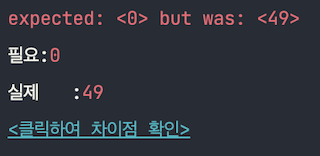

# 동시성 문제

CreatedDate: 2022년 10월 15일 오후 2:59

## Race condition

- 멀티 쓰레드가 공유자원을 접근하기 위해 경합하는 현상

```java
@Test
void concurrency_stock_decrease() throws InterruptedException {
    int threadCnt = 100;
    ExecutorService executorService = Executors.newFixedThreadPool(32);
    CountDownLatch latch = new CountDownLatch(threadCnt);

    for (int i = 0; i < threadCnt; i++) {
        executorService.submit(() -> {
            try {
                stockService.decrease(1L, 1L);
            } finally {
                latch.countDown();
            }
        });
    }

    latch.await();

    Stock stock = stockRepository.findById(1L).orElseThrow();

    assertEquals(0L, stock.getQuantity());
}
```


결과는 89

## 해결방법 1. Synchronized

- 공유자원에 대한 쓰레드 동기화 (접근중이라면 대기)

```java
@Transactional
public synchronized void decrease(Long id,Long quantity){
        Stock stock=stockRepository.findById(id).orElseThrow();

        stock.decrease(quantity);
        stockRepository.saveAndFlush(stock);
        }
```



결과 아직도 49

이유→ @Transactional은 새로운 클래스 작성

```java
public class TransactionStockService {

    private final StockService stockService;

    public TransactionStockService(StockService stockService) {
        this.stockService = stockService;
    }

    public void decrease(Long id, Long quantity) {
        startTransaction(); // begin

        stockService.decrease(id, quantity);

        endTransaction(); // commit
    }
}
```

다른 쓰레드가 이전 쓰레드가 endTransaction이 되기전에 decrease 메소드를 실행하여 반영이 안될 수 있음

@Transactional 어노테이션 삭제후 실행결과


### 문제점

- Java의 Synchronized는 하나의 프로세스안에서만 보장됨
    - 서버가 2대 이상일 경우 보장X

      

    - 대부분 운영환경에서는 여러대 서버를 운영하기 때문에 알맞지 않음

## 해결방법 2. DB Lock

### 종류

- `Pessimistic Lock`(비관적락)
    - 데이터에 Lock을 걸어 정합성을 맞춤
    - Exclusive Lock을 걸게되면 다른 트랜잭션에서는 Lock이 해제되기 전까지 데이터 접근 불가
    - Dead Lock이 걸릴 수 있기 때문에 주의해야함

      
        
- `Optimistic Lock`(낙관적락)
    - 실제 Lock을 이용하지 않고 Version을 이용함으로써 정합성을 맞춤
    - Pessimistic Lock보단 성능상 이점이 존재
        - but, 개발자가 재처리 로직을 짜줘야함
- `Named Lock`
    - 이름을 가진 mata-data locking방법
    - 이름을 가진 Lock을 획득한 후 해제될때까지 다른 세션은 해당 Lock을 획득X
    - Transaction이 종료될때 Lock이 자동해제되지 않음

## 해결방법 3. Redis
### 종류
1. Lettuce
   - setnx 명령어를 활용하여 분산락 구현
   - Spin Lock방식 (구현이 간단하지만 Redis에 부하를 줄 수 있다.)

2. Redisson
   - Pub - Sub 기반 Lock 제공
   - Lock 획득 / 재시도를 기본으로 제공
   - Lettuce보다 Redis에 부하가 덜함


### 실무
- 재시도가 필요하지 않은 lock은 lettuce 활용
- 재시도가 필요한 경우 redisson 활용

## MySQL vs Redis
### MySQL
- 이미 MySQL을 사용하고 있다면 별도의 비용없이 구축가능
- Redis보다는 성능이 좋지않다.

### Redis
- 사용하고 있지 않고 있다면 별도 구축해야함
- MySQL보다는 성능이 좋음